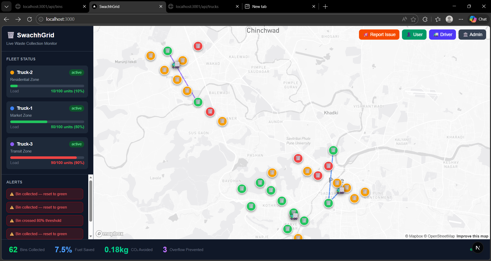
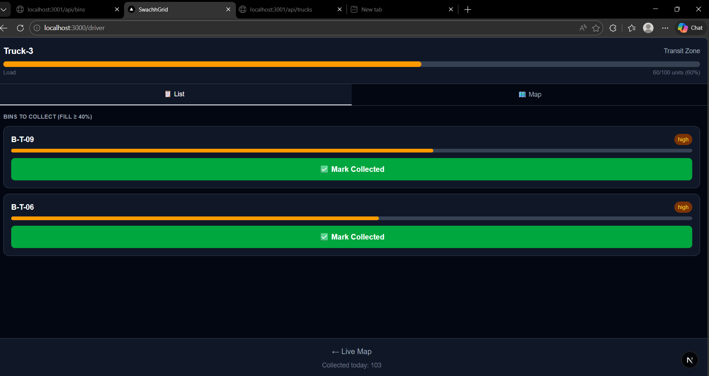

# 🗑️ SwachhGrid — Smart City Waste Collection Dashboard

> **Real-time waste bin monitoring + AI-powered dynamic truck route optimization for Pune, India**



---

## 🏆 Hackathon Project

SwachhGrid is a smart city waste management platform that uses real-time IoT simulation, machine learning predictions, and dynamic route optimization to reduce urban waste overflow, cut fuel costs, and empower citizens to participate in keeping their city clean.

**Aligned with:** UN SDG 11 — Sustainable Cities and Communities

---

## ✨ Key Features

### 🗺️ Live Map Dashboard
- 30 waste bins across 3 Pune zones shown on an interactive Mapbox map
- Bins color-coded in real time: 🟢 Green (<40%) → 🟡 Amber (40–75%) → 🔴 Red (>75%)
- Truck routes drawn as colored polylines per zone
- Animated 🚛 truck markers moving along optimized routes
- Live alerts panel showing bin collections and critical events

### ⚡ WOW Feature — One-Click Rerouting
- Click any bin on the map → popup opens
- Click **"Mark as Critical — Reroute Truck"**
- Bin instantly turns red + ALL truck routes redraw live on map in <500ms
- This is the demo centerpiece — real-time dynamic rerouting

### 🤖 AI-Powered Predictions (see ML Models section below)
- Random Forest model predicts current bin fill status (GREEN / YELLOW / RED)
- Gradient Boosting forecaster predicts fill levels at 6h, 12h, 24h ahead
- Model outputs feed directly into simulator fill rates per zone
- Overflow prediction shown in bin popup

### 👥 Role-Based Interfaces

| Role | URL | Purpose |
|------|-----|---------|
| 🏛️ Admin | `/admin` | Priority bin queue, dispatch controls, citizen reports, KPI stats |
| 🚛 Driver | `/driver` | Zone-specific bin list, mark collected, real-time updates |
| 👤 Citizen | `/user` | Read-only zone status, report waste issues |

### 📢 Citizen Reporting
- Submit waste issue with GPS location capture
- Photo upload support
- Orange ⚠️ pin appears on live map instantly via Socket.io
- Linked to bin priority scoring — more reports = higher priority

### 📊 Real-Time Stats Bar
- Bins collected today
- Fuel saved % (vs baseline unoptimized route)
- CO₂ avoided (kg)
- Overflow incidents prevented

---

## 🧠 ML Models — AI Backbone

> Both models trained in Google Colab. Live demo: [HuggingFace Space →](https://huggingface.co/spaces/tejas2110/smart_ai_hack)


### Model 1 — Smart Bin Fill Level Predictor

**Purpose:** Predicts current fill percentage (0–100%) and classifies bin status.

| Status | Fill Range | Action |
|--------|-----------|--------|
| 🟢 GREEN | 0–40% | Empty — No action needed |
| 🟡 YELLOW | 40–80% | Filling — Monitor closely |
| 🔴 RED | 80–100% | Full — Dispatch truck immediately |

**Dataset:** 100 bins × 720 hours (30 days) = 72,000 rows with realistic patterns including rush hours, weekends, zone differences, sensor drift, and collection events.

**Features used:**
- Raw sensor readings (ultrasonic distance, weight)
- Time-based features (hour, day, cyclic encodings)
- Fill trends (rates, rolling averages)
- Service tracking (hours since last collection)
- Categorical encodings (bin type, location, zone)

**Models:**
- `RandomForestRegressor` → predicts exact fill %
- `RandomForestClassifier` → predicts GREEN / YELLOW / RED

**Performance:**
- Regression: MAE < 2%, R² > 0.95
- Classification: Accuracy > 94%, strong recall for RED bins
- Cross-validation confirms generalization across bins

**Outputs:** `model1_regression.pkl`, `model1_classifier.pkl`, `model1_features.pkl`, `model1_metadata.pkl`

---

### Model 2 — Garbage Flow Forecaster

**Purpose:** Forecasts future bin fill levels at 6h, 12h, and 24h ahead and recommends proactive collection scheduling.

**Why it matters:**
- A bin at 60% filling at 5%/hour needs a truck in 8 hours
- A bin at 70% filling at 0.5%/hour can safely wait 2 days
- Enables proactive route planning vs reactive emergency dispatch

**Features used:**
- Current fill % and sensor readings
- Fill trends (rates, rolling averages, acceleration)
- Time context (hour, day, cyclic encodings, rush hour flags)
- Service context (hours since collection, estimated hours to full)
- Categorical encodings (bin type, location, zone)

**Models:** `GradientBoostingRegressor` (better for sequential forecasting)

**Performance:**

| Horizon | MAE | Use Case |
|---------|-----|---------|
| 6h forecast | ~2–3% | Dispatch planning |
| 12h forecast | ~4–5% | Route scheduling |
| 24h forecast | ~6–7% | Fleet planning |

**Outputs:** `model2_forecast_6h.pkl`, `model2_forecast_12h.pkl`, `model2_forecast_24h.pkl`, `model2_features.pkl`, `model2_metadata.pkl`

---

### How Models Connect to SwachhGrid

```
Model 1 + Model 2 (Google Colab)
        ↓
  Predicted fill rates per zone:
  market=4.5%/tick | residential=1.5%/tick | transit=3.2%/tick
        ↓
  Hardcoded into server/simulator.js as zone fill_rate values
        ↓
  Simulator ticks every 30s → bins fill at ML-predicted rates
        ↓
  Route optimizer triggers when bins cross 80% threshold
```

> **For judges:** The ML model outputs are the intelligence behind our simulator. We can show the full Colab notebook with training data, feature engineering, and evaluation metrics on request.

---

## 🏗️ Architecture

```
┌─────────────────────────────────────────────────────────┐
│                    CLIENT (Next.js :3000)                │
│  ┌──────────┐  ┌──────────┐  ┌──────────┐  ┌────────┐  │
│  │  BinMap  │  │FleetPanel│  │ StatsBar │  │Admin/  │  │
│  │ (Mapbox) │  │(Sidebar) │  │ (Bottom) │  │Driver/ │  │
│  └────┬─────┘  └────┬─────┘  └────┬─────┘  │User    │  │
│       └─────────────┴─────────────┘         └────────┘  │
│                      Socket.io Client                    │
└──────────────────────┬──────────────────────────────────┘
                       │ WebSocket
┌──────────────────────┴──────────────────────────────────┐
│                   SERVER (Express :3001)                 │
│  ┌────────────┐  ┌──────────────┐  ┌─────────────────┐  │
│  │ Simulator  │  │Route         │  │  Socket.io      │  │
│  │ (node-cron │  │Optimizer     │  │  Events:        │  │
│  │  30s tick) │  │(Greedy VRP)  │  │  bin:update     │  │
│  └─────┬──────┘  └──────┬───────┘  │  route:update   │  │
│        └────────────────┘          │  alert:new      │  │
│                                    │  report:created │  │
│  REST API: /api/bins /api/trucks   │  stats:update   │  │
│            /api/reports /api/stats └─────────────────┘  │
└──────────────────────┬──────────────────────────────────┘
                       │ pg (raw SQL)
┌──────────────────────┴──────────────────────────────────┐
│              Neon PostgreSQL (Cloud)                     │
│   bins | trucks | routes | bin_history | reports | stats │
└─────────────────────────────────────────────────────────┘
```

---

## 🗺️ Zones — Pune

| Zone | Area | Bins | Fill Rate | Truck |
|------|------|------|-----------|-------|
| 🔵 Market | Shivajinagar | 10 | 4.5%/tick | Truck-1 (Blue) |
| 🟡 Residential | Kothrud | 10 | 1.5%/tick | Truck-2 (Amber) |
| 🟣 Transit | Hinjewadi | 10 | 3.2%/tick | Truck-3 (Purple) |

---

## ⚙️ Route Optimization Algorithm

Custom **Greedy Nearest-Neighbor VRP** (Vehicle Routing Problem) in JavaScript:

1. Filter bins with `fill_level >= 60` OR `status = 'critical'`, sorted by priority score
2. Each truck stays zone-locked (market/residential/transit)
3. Priority score = `(fill_level × 0.4) + (citizen_reports × 10 × 0.3) + (urgency × 0.3)`
4. Nearest-neighbor greedy assignment minimizes total distance per truck
5. Haversine formula for accurate distances between coordinates
6. Re-runs only when a bin crosses 80% threshold (not every tick)
7. Saves GeoJSON LineString to DB → emits `route:update` → frontend redraws

**Fuel savings calculation:** `((baselineDistance - optimizedDistance) / baselineDistance) × 100`

---

## 🚀 Getting Started

### Prerequisites
- Node.js 18+
- Neon PostgreSQL account (free tier works)
- Mapbox account (free tier works)

### Installation

```bash
# Clone the repo
git clone https://github.com/yourusername/swachh-grid.git
cd swachh-grid

# Install server dependencies
cd server
npm install

# Install client dependencies
cd ../client
npm install
```

### Environment Setup

**server/.env**
```env
DATABASE_URL=postgresql://...@neon.tech/swachhgrid?sslmode=require
PORT=3001
```

**client/.env.local**
```env
NEXT_PUBLIC_MAPBOX_TOKEN=pk.eyJ1...
NEXT_PUBLIC_SOCKET_URL=http://localhost:3001
```

### Database Setup

```bash
# Create all tables
node scripts/init-db.js

# Seed 30 bins + 3 trucks across Pune zones
node scripts/seed.js
```

### Run

```bash
# Terminal 1 — Start backend
cd server
node index.js
# ✅ SwachhGrid server on port 3001

# Terminal 2 — Start frontend
cd client
npm run dev
# ✅ Next.js on port 3000
```

Open [http://localhost:3000](http://localhost:3000)

---

## 📁 Project Structure

```
swachh-grid/
├── server/
│   ├── index.js              ← Express + Socket.io
│   ├── db.js                 ← Neon pg pool
│   ├── simulator.js          ← node-cron bin fill simulation
│   ├── routeOptimizer.js     ← Greedy VRP algorithm
│   └── routes/
│       ├── bins.js           ← GET/POST bins, override, collected
│       ├── trucks.js         ← GET trucks, routes, position
│       ├── reports.js        ← Citizen reports CRUD
│       └── stats.js          ← KPI stats
├── client/
│   ├── app/
│   │   ├── page.jsx          ← Main map dashboard
│   │   ├── admin/page.jsx    ← Admin control panel
│   │   ├── driver/page.jsx   ← Driver interface
│   │   ├── user/page.jsx     ← Citizen zone status
│   │   └── report/page.jsx   ← Citizen reporting form
│   └── components/
│       ├── BinMap.jsx        ← Mapbox map + animations
│       ├── BinPopup.jsx      ← Bin click popup + override
│       ├── FleetPanel.jsx    ← Truck sidebar
│       └── StatsBar.jsx      ← Bottom KPI bar
└── scripts/
    ├── init-db.js
    └── seed.js
```

---

## 🔌 Socket.io Events

| Event | Direction | Payload |
|-------|-----------|---------|
| `bin:update` | Server → Client | `{ bins: [...] }` |
| `route:update` | Server → Client | `{ routes: {...} }` |
| `alert:new` | Server → Client | `{ binId, message, type }` |
| `report:created` | Server → Client | `{ report }` |
| `stats:update` | Server → Client | `{ binsCollected, fuelSaved, co2Saved }` |

---

## 📸 Screenshots

| Dashboard | Bin Popup | Driver View |
|-----------|-----------|-------------|
|  |  |  |

| Admin Panel | Citizen Report | User View |
|-------------|----------------|-----------|
|  |  |  |

---

## 🛠️ Tech Stack

| Layer | Technology |
|-------|-----------|
| Frontend | Next.js 14 App Router + Tailwind CSS |
| Map | Mapbox GL JS (light style) |
| Realtime | Socket.io |
| Backend | Node.js + Express |
| Database | Neon PostgreSQL (raw `pg` queries) |
| Simulation | node-cron (30s intervals) |
| ML Models | Random Forest + Gradient Boosting (Python/Colab) |
| Hosting | Local dev / deployable to Vercel + Railway |

---

## 🤝 Contributing

This is a hackathon project. Feel free to fork and build on it!

---

## 📄 License

MIT License — see [LICENSE](./LICENSE)

---

## 👤 Author

Built solo for a smart city hackathon.  
ML Models: [HuggingFace Space](https://huggingface.co/spaces/tejas2110/smart_ai_hack)

---

*SwachhGrid — Because every bin matters.* 🗑️
